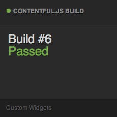
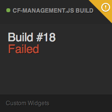

# travis-notify-geckoboard

Notify Geckoboard widgets with Travis CI build results




## Usage

1. Add a custom text widget to your Geckoboard dashboard
2. Add this to your `.travis.yml`:

``` yaml
before_script: npm install -g travis-notify-geckoboard && travis-notify-geckoboard -a GECKOBOARD_API_KEY -w GECKOBOARD_WIDGET_KEY -s
after_script: travis-notify-geckoboard -a GECKOBOARD_API_KEY -w GECKOBOARD_WIDGET_KEY
```
